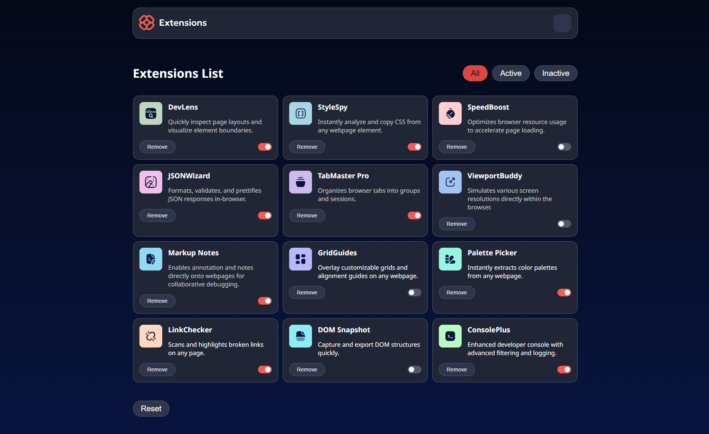

# Browser extensions manager UI

This is a solution to the [Browser extensions manager UI challenge on Frontend Mentor](https://www.frontendmentor.io/challenges/browser-extension-manager-ui-yNZnOfsMAp). Frontend Mentor challenges help you improve your coding skills by building realistic projects. 

## Table of contents

- [Overview](#overview)
  - [The challenge](#the-challenge)
  - [Screenshot](#screenshot)
  - [Links](#links)
- [My process](#my-process)
  - [Built with](#built-with)
  - [Useful resources](#useful-resources)
  - [Challenges](#challenges)
  - [Notes](#notes)
- [Author](#author)

## Overview

### The challenge

Users should be able to:

- Toggle extensions between active and inactive states
- Filter active and inactive extensions
- Remove extensions from the list
- Select their color theme
- View the optimal layout for the interface depending on their device's screen size
- See hover and focus states for all interactive elements on the page

### Screenshot

### Links

- Live Site URL: [https://lighthearted-hummingbird-aa2b05.netlify.app/](https://lighthearted-hummingbird-aa2b05.netlify.app/)

## My process

### Built with

- Semantic HTML5 markup
- CSS custom properties
- Flexbox
- [Svelte](https://svelte.dev/) - JS library

### Useful resources

- [Svelte](https://svelte.dev/)
- [JSONbin](https://jsonbin.io/)
- [chatGPT](https://chatgpt.com/)

### Challenges

- The checkbox inputs were not working in iOS, although Chrome dev tools didn't show this. I had to change the whole HTML structure so they start appearing properly.
- The biggest challenge was to make the themes switch, because the button is in component, which is the grandparent of some of the component, who needed a change. Of course, I could hardcode the theme classes, but that way I wouldn't know about tick, which is very useful when we need to get async data from child components in Svelte.

### Notes

- The app has no backend, because the focus here is the frontend. The original db is the JSON file.

## Author

- Frontend Mentor - [@xaoccc](https://www.frontendmentor.io/profile/xaoccc)

